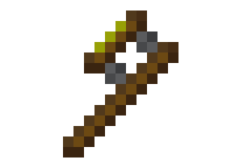

# shifter\_tool

This is a mod for [Minetest][1]. It implements a tool for shifting nodes as with
the pistons from [Mesecons][2]. It actually uses the API of `mesecons_mvps`,
meaning that it is quite compatible with other mods (the API is widely used.)

## Licenses

### Source code

The source code of this project is licensed under the LGPL v3 (or later,)
as stated in the source code's comments.

### Sounds

The sounds are not by me. See the end of the Attribution section.

### Images and other files not otherwise licensed

These files are licensed under a [CC BY-SA 3.0 license][3].

They are also under the same copyright as the source files:

    Copyright © 2021  Jude Melton-Houghton

## Attribution

### Tool texture and screenshot.png

The texture can be found in [shifter\_tool\_shifter.png][4].
[screenshot.png][5] has the same attribution since it is a scaled-up version of
the texture.

#### Tool handle texture

The texture of the shifter tool handle is a modified part of another texture:
"[default\_tool\_steelaxe.png][6]" by [BlockMen][7] is licensed under a
[CC BY-SA 3.0 license][3]. It is copyrighted as follows:

    Copyright (C) 2010-2018 BlockMen

(The above notice is slightly different from what appears in [license.txt][8].)

#### Tool head texture

The yellow color on the head of the tool is taken from
"[mesecons\_piston\_pusher\_front\_sticky.png][9]" by Vanessa Dannenberg
([VanessaE][10],) which is licensed under a [CC BY-SA 3.0 license][3].
I couldn't find a copyright notice, but here is the notice in Mesecons'
[COPYING.txt][11]:

    Copyright (C) 2011-2016 Mesecons Mod Developer Team and contributors

### Pushing and pulling sounds

[shifter\_tool\_push.ogg][12] and [shifter\_tool\_pull.ogg][13] are unmodified
copies of "[piston\_extend.ogg][14]" and "[piston\_retract.ogg][15]",
respectively. Both of these are by suzenako, and both are licensed under a
[CC BY-SA 3.0 license][3]. Again, this is part of the Mesecons modpack, so the
only copyright notice I could find is this:

    Copyright (C) 2011-2016 Mesecons Mod Developer Team and contributors

[1]: https://www.minetest.net/
[2]: https://mesecons.net/
[3]: https://creativecommons.org/licenses/by-sa/3.0/
[4]: textures/shifter_tool_shifter.png
[5]: screenshot.png
[6]: https://github.com/minetest/minetest_game/blob/a3e92c4524582a492099a3b21ed55a61b4ec18e3/mods/default/textures/default_tool_steelaxe.png
[7]: https://github.com/BlockMen
[8]: https://github.com/minetest/minetest_game/blob/master/mods/default/license.txt
[9]: https://github.com/minetest-mods/mesecons/blob/cdd9a93da9c8ed5e89993bc225647dbce71f96f4/mesecons_textures/textures/mesecons_piston_pusher_front_sticky.png
[10]: https://gitlab.com/VanessaE
[11]: https://github.com/minetest-mods/mesecons/blob/master/COPYING.txt
[12]: sounds/shifter_tool_push.ogg
[13]: sounds/shifter_tool_pull.ogg
[14]: https://github.com/minetest-mods/mesecons/blob/367a41416bb3367f81e18afdb043cd196dd4f324/mesecons_pistons/sounds/piston_extend.ogg
[15]: https://github.com/minetest-mods/mesecons/blob/367a41416bb3367f81e18afdb043cd196dd4f324/mesecons_pistons/sounds/piston_retract.ogg
